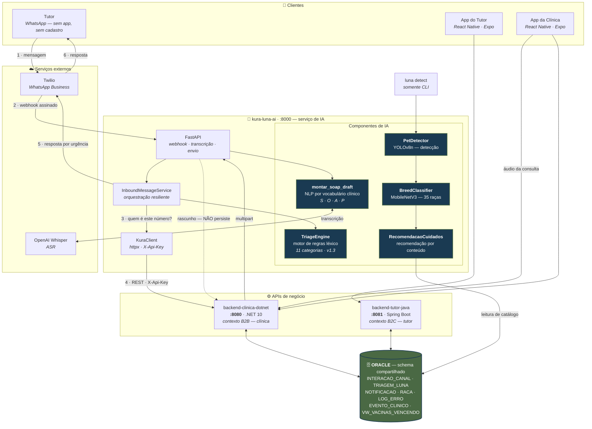
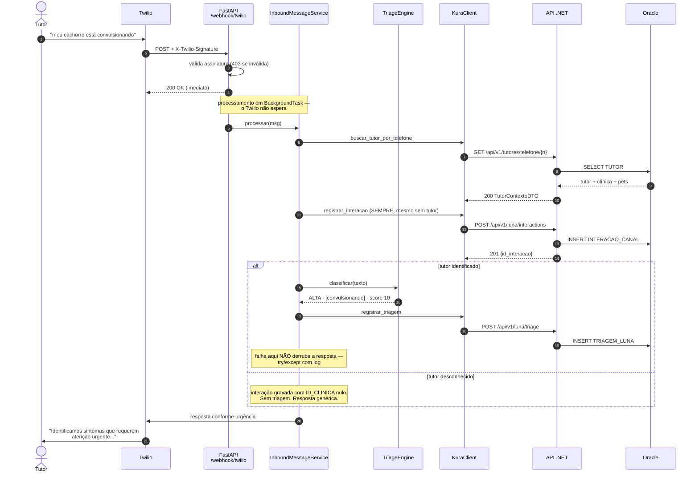
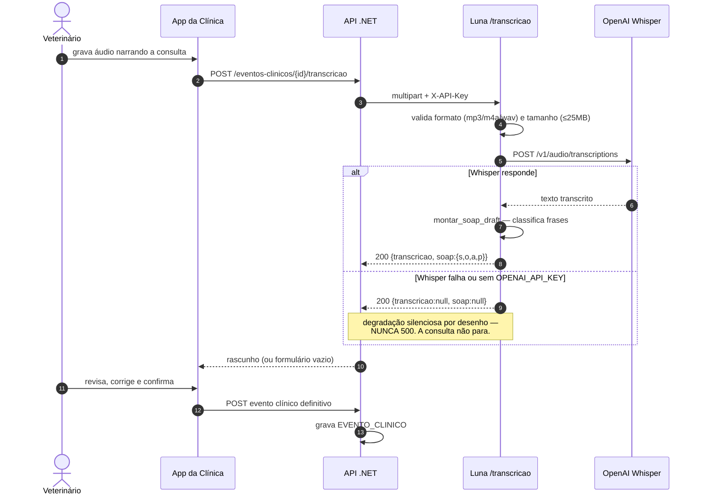
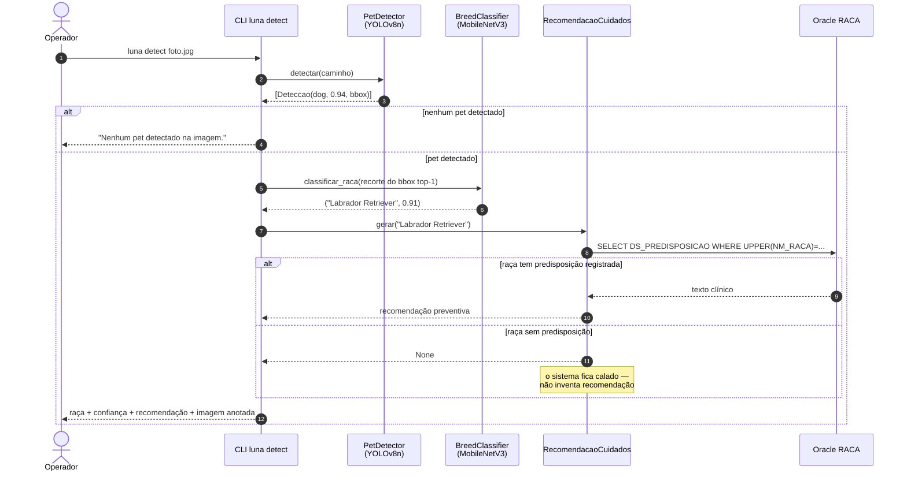
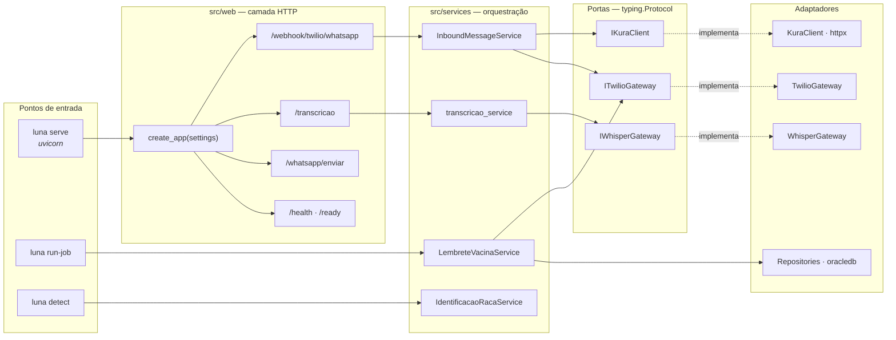
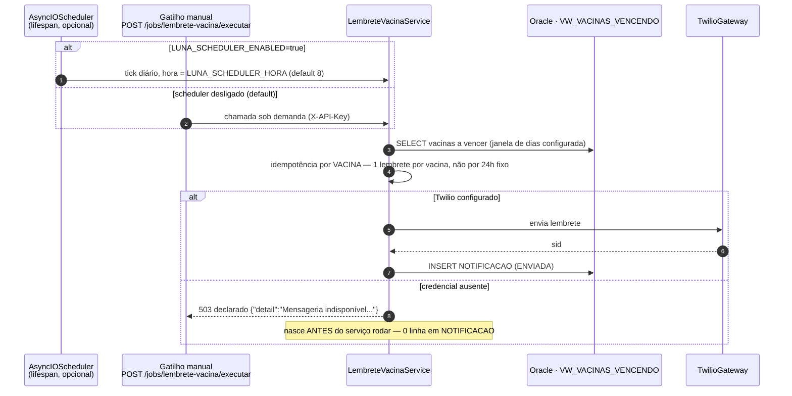

# Arquitetura — Luna

> **Escopo deste documento:** os diagramas abaixo cobrem o estado **v2** do serviço —
> servidor FastAPI, webhook do WhatsApp, motor de triagem, integração com a API .NET,
> transcrição clínica e o pipeline de visão computacional.
>
> A definição do componente de IA (problema, dados, abordagem, limites) está em
> **[`IA_DEFINICAO.md`](IA_DEFINICAO.md)**.

---

## 1. Diagrama arquitetural do ecossistema

Este é o diagrama de referência: mostra a comunicação entre **aplicações**, **APIs**,
**banco de dados** e **componentes de IA**.



### Os três princípios que este desenho expressa

| Princípio | Como aparece no diagrama |
|---|---|
| **Um banco, duas APIs, sem HTTP entre elas** | `NET` e `JAVA` tocam o mesmo `ORA` e não têm seta entre si. A integração é pelo schema. |
| **A IA escreve *através* da API, não no banco** | `KuraClient → NET → ORA`. A Luna só lê Oracle direto para **catálogo** (`RACA`), onde não há regra de tenancy. |
| **A IA é assistiva** | A seta de transcrição volta pontilhada e rotulada *"NÃO persiste"*. Quem salva é o veterinário. |

---

## 2. Fluxo principal — triagem de urgência por WhatsApp



**A ordem importa e é deliberada:** a interação é registrada (passo 8) **antes** da triagem
(passo 12). Se a classificação ou o registro dela falharem, a mensagem do tutor já está
salva. O sinal nunca se perde.

---

## 3. Fluxo — transcrição de consulta em rascunho SOAP



> ⚠️ **A degradação é silenciosa de propósito, e isso tem um custo:** sem
> `OPENAI_API_KEY` configurada, o rascunho volta vazio **sem nenhum erro visível**. Numa
> demonstração, isso é indistinguível de "o veterinário não gravou áudio". Conferir a
> variável antes de demonstrar.

---

## 4. Fluxo — identificação de raça por foto



> 🔴 **Este fluxo não é executável a partir do repositório.** O checkpoint do
> `BreedClassifier` não é versionado, e este pipeline **não tem endpoint HTTP** — só existe
> pela CLI. Ver [`IA_DEFINICAO.md`](IA_DEFINICAO.md) §9.2.

---

## 5. Componentes internos e composition root



**Por que `Protocol` e não classe base abstrata:** o teste substitui o adaptador sem
herdar de nada — basta ter os métodos com a assinatura certa. Isso mantém os testes
independentes da hierarquia de classes de produção.

**Por que imports preguiçosos no composition root:** `luna run-job` e `luna serve` não
carregam `torch` nem `ultralytics`, que só o `luna detect` precisa. Sem isso, subir o
servidor pagaria segundos de import e centenas de megabytes de memória por um pipeline que
aquele processo nunca usa.

---

## 6. Fila de triagem, lembrete de vacina e o scheduler (`LU-04`/`LU-08`)

### 6.1 Fila de triagem — leitura pelo app da clínica

A Luna **não expõe** a fila; quem consulta é o app da clínica, direto no `.NET`, por JWT:

```
GET /api/v1/luna/triagens   (Authorization: Bearer <JWT de clínica>)
```

`idClinica` sai sempre do token (`IClinicaContext`), nunca de parâmetro de URL — isolamento
multi-tenant provado por mutação no G4 (`LU-16`, duas mutações mordendo: predicado primário e
o `IdClinica` do JOIN com `INTERACAO_CANAL`).

### 6.2 Lembrete de vacina — job, gatilho manual e scheduler



- **`LUNA_SCHEDULER_ENABLED` tem default `false`** (`src/config/settings.py:43`) — o container
  padrão **não** dispara lembrete sozinho; só o gatilho manual (`POST
  /jobs/lembrete-vacina/executar`) roda, e só quando chamado. Ligar o scheduler é decisão
  explícita de ambiente, para não rodar em mais de uma réplica.
- **Idempotência por vacina** (ruling do Felipe, 15/09): um `asyncio.Lock` evita o tick e o
  gatilho manual rodarem simultaneamente; a janela de idempotência é derivada da antecedência
  configurada (`24 × dias_antecedência` horas), não um valor fixo de 24h.
- **Verificado no G4 (`LU-16`), e é o estado real desta máquina:** com `TWILIO_SID`/`TWILIO_TOKEN`
  vazios no processo, o gatilho devolve `503` **honesto** (nunca `500` cru) e **nenhuma linha**
  é gravada em `NOTIFICACAO` — a falha nasce na dependência, antes do serviço rodar. O ciclo
  completo (`NOTIFICACAO` com a clínica certa, 2º disparo bloqueado, tutor vendo no app) **não
  foi verificado ao vivo** nesta máquina; ver `IA_DEFINICAO.md` §9 e o ledger `lu-16-revisao.md`.

---

## 7. Decisões de design

| Decisão | Alternativa descartada | Por quê |
|---|---|---|
| Motor de regras na triagem | LLM | Auditabilidade, risco de alucinação em contexto clínico, custo e latência — ver `IA_DEFINICAO.md` §3 |
| Escrita via API .NET | Escrita direta no Oracle | Regra de multi-tenancy em um lugar só. Duas implementações divergiriam |
| `BackgroundTask` no webhook | Processamento síncrono | O Twilio marca timeout e reentrega. `200` imediato evita duplicidade |
| Falha de telemetria não bloqueia | Propagar erro | O tutor precisa de resposta mesmo com o .NET fora do ar |
| Interação gravada antes da triagem | Gravar tudo junto no fim | Se a triagem falhar, a mensagem não se perde |
| `secrets.compare_digest` | `==` | Comparação comum vaza a chave por tempo de execução |
| `raise ... from None` | `raise ... from exc` | Encadear causa faz `logger.exception` reimprimir o telefone do tutor — ver `IA_DEFINICAO.md` §11.2 |
| Degradar transcrição com `200` | Devolver `500` | A consulta não pode parar porque a IA parou |
| `RecomendacaoCuidados` devolve `None` | Texto genérico de fallback | Não inventar recomendação para raça desconhecida |
