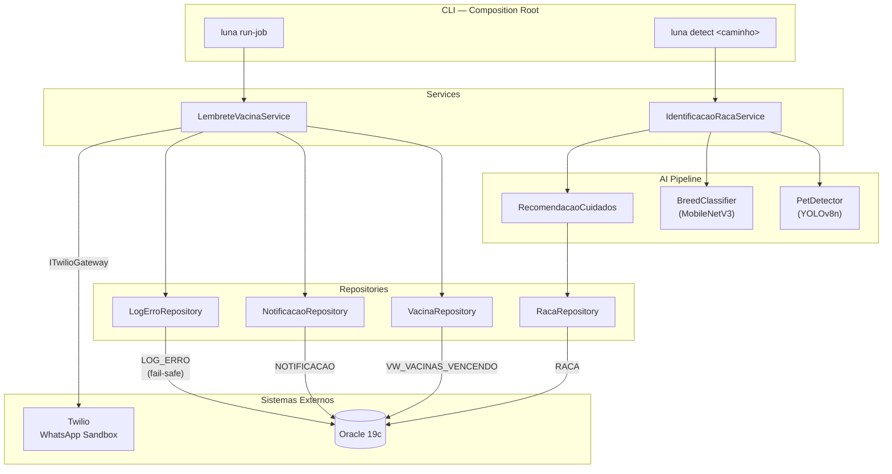
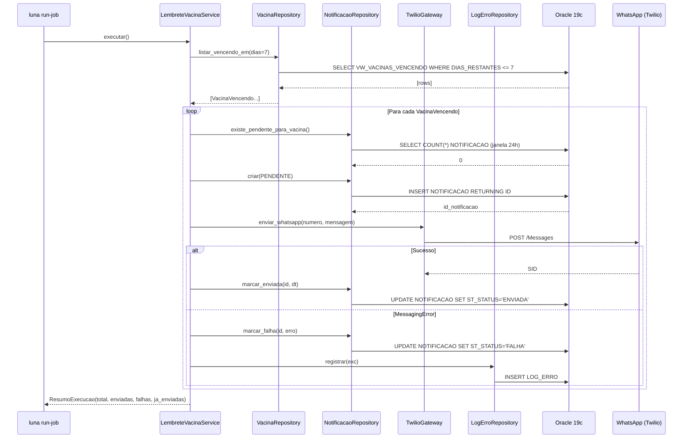
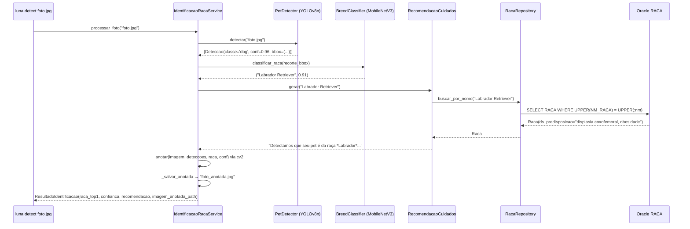

# Arquitetura — Luna

## Visão geral

Luna segue uma arquitetura em camadas estrita, com injeção de dependência no construtor e composition root centralizado em `cli/main.py`. Nenhum service ou repository instancia suas próprias dependências.

```
cli/main.py  (Composition Root)
     │
     ├── LembreteVacinaService
     │       ├── VacinaRepository        → Oracle VW_VACINAS_VENCENDO (leitura)
     │       ├── NotificacaoRepository   → Oracle NOTIFICACAO (escrita)
     │       ├── TwilioGateway           → Twilio REST API
     │       └── LogErroRepository       → Oracle LOG_ERRO (fail-safe)
     │
     └── IdentificacaoRacaService
             ├── PetDetector             → YOLOv8n (ultralytics)
             ├── BreedClassifier         → MobileNetV3 (torchvision)
             └── RecomendacaoCuidados
                     └── RacaRepository  → Oracle RACA (leitura)
```

---

## Diagrama de componentes



---

## Fluxo: lembrete de vacinas



---

## Fluxo: identificação de raça



---

## Decisões de design

| Decisão | Justificativa |
|---------|--------------|
| Injeção de dependência no construtor | Testabilidade — mocks trocados sem tocar produção |
| `OracleConnectionPool` como singleton | Custo de criação de pool; criado uma vez no composition root |
| `LogErroRepository` fail-safe | Falha no log nunca mascara a exceção original nem derruba o lote |
| `LembreteVacinaService` resiliente por item | Uma falha Twilio não cancela os demais lembretes do lote |
| Idempotência com janela 24 h | Evita duplicação se o job for reiniciado por falha de infra |
| Lazy imports em `cli/main.py` | `luna run-job` não carrega torch/ultralytics; `luna detect` não carrega Twilio |
| `oracledb` thin mode | Elimina dependência do Oracle Instant Client no ambiente de deploy |
| Bind variables (`:param`) | Prevenção de SQL injection e reuso do plano de execução Oracle |
